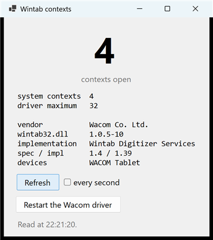

# Wintab contexts

A window with one big number in it: how many Wintab contexts the driver currently has open.



It exists to make a leak visible. Leave it open, kill a drawing application, and the number goes up
and stays up. Close one properly and the number comes back down. That is the whole of
[the context leak](../../Docs/WINTAB-CONTEXT-LEAK.md), on screen, without a debugger.

## Getting it

It ships as a single self-contained file: download `WintabContexts.exe`, double-click it, nothing
to install. About 49 MB, which is what carrying its own copy of .NET costs.

**It has its own release, on its own tag** -- `wintab-contexts/v*` rather than `release/v*` -- so
that the library's frequent releases are not 50 MB heavier for a tool that rarely changes. It is
still built by the solution on every push, so it cannot break unnoticed between releases.

Self-contained unlike the sample applications beside it, and for a reason particular to what it
is for: it is reached for at the moment something has already gone wrong with the pen, and
"first install the .NET runtime" is a poor thing to say to somebody in that position.

It is **not** in the NuGet package, which is a library for people writing applications rather
than a bag of tools.

To run it from a clone:

```
dotnet run --project Tools/WintabContexts
```

## What it shows

| | |
|---|---|
| **contexts open** | every context open on the machine, whoever opened it — `WTI_STATUS / STA_CONTEXTS` |
| **system contexts** | how many of those drive the cursor as well as delivering packets — `WTI_STATUS / STA_SYSCTXS` |
| digitising contexts | said in words, not set as a number, because it is **inferred**: Wintab has no counter for these, so it is the two numbers subtracted |
| driver maximum | what the driver says it supports, and the constant it came from. It does not enforce it |
| vendor | the company recorded in `wintab32.dll` — whose driver is answering |
| wintab32.dll | that file's version |
| implementation | the name Wintab gives itself |
| spec / impl | the API version it claims, and its own |
| devices | every device the driver lists, by the name it gives each |

Every number is printed with the Wintab question that produced it, so a figure on screen can be
traced to a documented constant rather than taken on this tool's word for it. The one without a
constant is the one that has none: digitising contexts are inferred.

The number starts blank. Until Refresh is pressed nothing has been asked, and a figure whose age
is unknown is worse than no figure. **every second** keeps it current, which is what to use while
demonstrating.

**Nothing here opens a context.** Every call is `WTInfoA`, which only reads. A tool for counting
contexts that took one of its own would be adding to the number it reports.

## Restarting the driver

Clears leaked contexts in a few seconds, without a reboot. Windows asks for administrator rights
for that, so there is a prompt; declining it is fine and the tool says so.

**Wacom only.** The service name differs by vendor and only Wacom's has been tested, so the button
disables itself with an explanation on any machine that does not have it, rather than guessing at
a name and restarting something else.

Applications that were running at the time lose the contexts they were holding. WinPenKit-based
ones notice and reopen within a few seconds; others generally need restarting.

## What it works with

Any vendor, for the reading. `Wintab32.dll` is the standard entry point and every vendor installs
their implementation under that one filename, so the counts and the vendor line come from whoever
is actually installed.

That said — **only a Wacom driver has been tested.** Huion, XP-Pen, Gaomon, Xencelabs and the rest
are unexamined, and a driver that does not implement a counter reports "not reported" rather than
a misleading zero.
